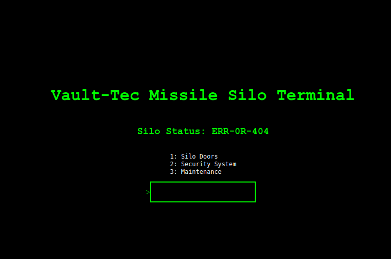

# Secure Terminal

## Challenge Host: http://secureterm.pwn.site:80/

## Screenshots:


## Build and Run
`sudo ./build.sh`

## Secure Terminal
### Category: Secure Terminal
### Value: 20
### Description
```
- Initiating Connection....

- Please Connect to : secureterm.pwn.site:8045

Challenge Courtesy of <a href="https://github.com/BC-SECURITY" target="_blank">BC-Security!</a>
```


### Flag
`flag{584d0218c9c70bfebb5416967f5a35a1}`

### Solution
1. Once the server is running, open your web browser and navigate to http://localhost:8045/.
2. You will be presented with the landing page of the Missile Terminal
3. The menus give error messages that are hints to the login password and login page.
4. Using the hints, you can figure out the correct login password is `pipboy4life`.
5. Once logged in, you can access the Secure Terminal, which allows bash commands in the data folder.
6. Type `ls -a security` to see that there is a hidden launch key file.
7. Use `cat security/.launch_key` to get the password.
8. Return to the Missile Control page and type 4 to find the hidden control menu.
9. Select enter launch key and type in `Death is a preferable alternative to communism`.
10. The flag will be displayed on the screen: flag{584d0218c9c70bfebb5416967f5a35a1}.
